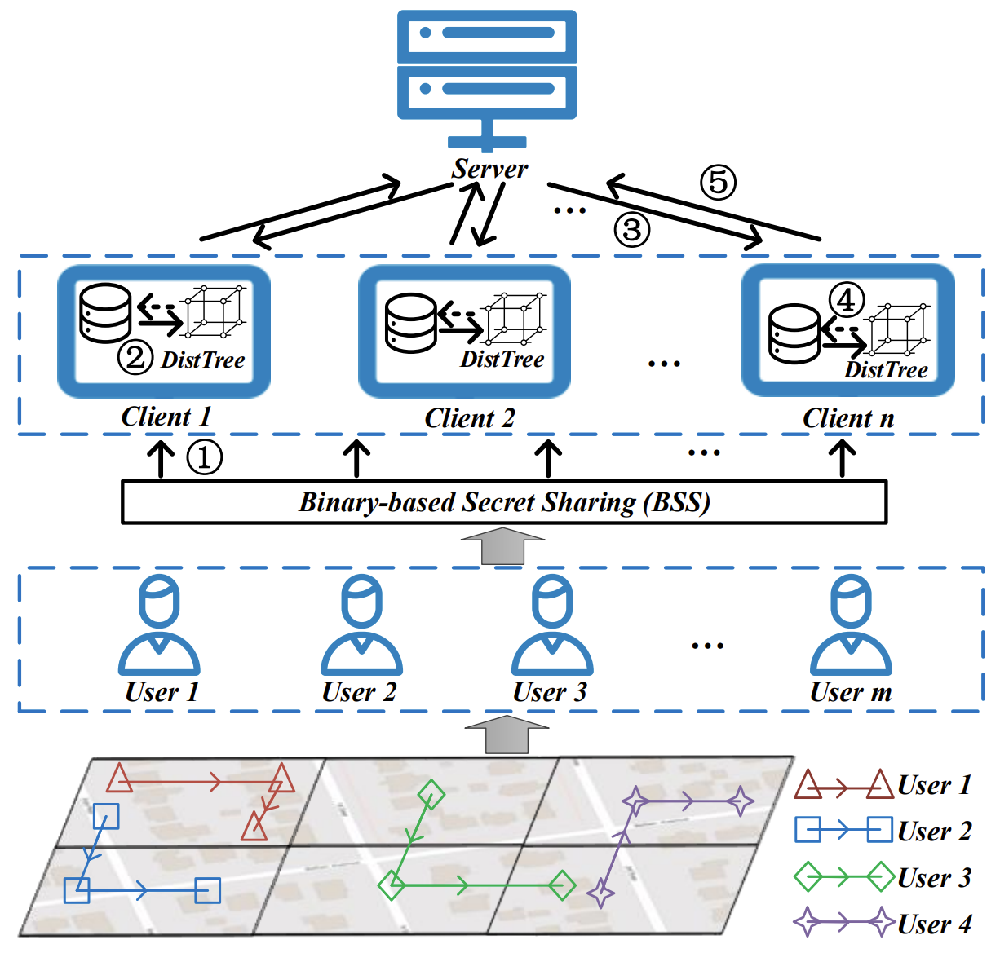

# FedCTQ

In this paper, we introduce FedCTQ, a novel hierarchical federation-based framework, tailored for contact tracing
queries. To bolster the data privacy and security of F-CTQ, we propose a binary-based secret-sharing scheme that ensures
robust privacy protection for user trajectory data, while maintaining 100% query accuracy. Concurrently, we address the
efficiency of F-CTQ by presenting DistTree, a binary-based distance tree index, enabling real-time and accurate query.
Our approach significantly improves F-CTQ performance, achieving a 4.7× to 14.8× speedup compared to competitors, as
demonstrated in extensive experiments.

## Environment

SecretFlow.version = 1.0.0 
Python.version = 3.8.17 

## Dataset

We give a small dataset of gowalla for running with 'gowalla_small.csv'. Other datasets used can be
downloaded in the paper.

## Complication

The running example of fedctq is as below: 
python main.py --dataset Gowalla_Small --patients_num 1 --path 'your_path' --ratio 1.0 --address 'your_address'